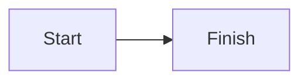

# marcotulio956.github.io

created with [Axios](https://github.com/axios/axios)

credit to [awesome-designs](https://github.com/VoltAgent/awesome-design-md) for the [opencode.ai design.md](https://github.com/VoltAgent/awesome-design-md/tree/main/design-md/opencode.ai)

## Publishing posts

Posts are Markdown files in `posts/`. Add an entry for each new file to `posts-data.js` using its filename and a unique slug. Each post needs this front matter:

```md
---
title: Post title
summary: A short card summary.
date: 2026-07-28
labels: engineering, research
---
```

Math in posts is rendered with KaTeX. Use `$$...$$` or `\[...\]` for display equations, and `\(...\)` or `$...$` for inline equations.

Mermaid diagrams are also rendered client-side. Put Mermaid syntax in a fenced code block with the `mermaid` language:



## Choosing projects

Edit the `projects` list in `profile-data.js` to choose the project cards and their display order. Each `repository` value must match a repository name on your GitHub profile. An optional `title` or `description` overrides the values fetched from GitHub.

```js
projects: [
  { repository: "my-project", description: "What it does." },
  { repository: "another-project", title: "A clearer display title" },
],
```

## Embedding a Jupyter notebook in a post

Add a `notebook` line to a post's front matter with its GitHub `blob` URL. The post page renders the full notebook through nbviewer and keeps a direct GitHub link below it.

```md
---
title: Ant Colony Optimization for the TSP
summary: An implementation notebook for an ant-colony solver.
date: 2026-07-29
labels: algorithms, ai
notebook: https://github.com/marcotulio956/smart.algoAI/blob/master/antc/ACO_TSP.ipynb
---
```
### Python for opening ports
```
python3 -m http.server 8000
```

_fell free to use these repos_
