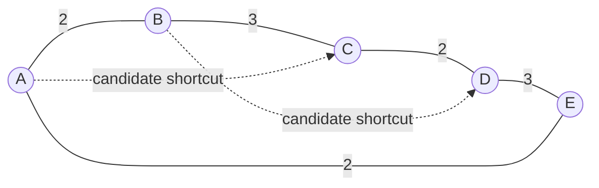
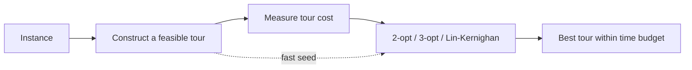

# Constructive Heuristics — Notes from TSP, Greedy Choice, and Approximation

> **Question for these notes:** if an exact algorithm is too expensive, how can we build a complete feasible(preferably or near-optimal) solution quickly—and how honest can we be about its quality?

This post is mainly a set of working notes on **constructive heuristics**, using the travelling-salesman problem (TSP) as the running example. The central sources are CLRS, third edition (2009), especially its dynamic-programming, greedy, and approximation chapters, and the TSP case study in *Local Search in Combinatorial Optimization* (Aarts and Lenstra, 1997). The latter is particularly useful because it connects a constructor to the next phase of a solver: **local improvement needs a tour to start from**.

The short version: a constructive heuristic grows a feasible solution from nothing (or from a very small seed), commits to decisions along the way, and stops when the solution is complete. It is usually fast; it is not automatically optimal.

## 1. First note: what “constructive” means

For a minimization problem with feasible set \(\mathcal F(I)\), objective \(f\), and instance \(I\), an optimal solution has value

$$
OPT(I) = \min_{x \in \mathcal F(I)} f(x).
$$

A **constructive heuristic** maintains a partial solution \(s_t\), chooses an extension, and eventually returns a complete solution:

$$
s_0 \;\to\; s_1 \;\to\; \cdots \;\to\; s_T \in \mathcal F(I).
$$

The important word is *feasible*: on completion, the output must satisfy the problem constraints. The word *heuristic* says something different: we may have no proof that \(f(s_T)=OPT(I)\), and perhaps no worst-case approximation bound either.

I find this distinction useful:

| Method | Builds a feasible answer? | Revises earlier choices? | What can be promised? |
| --- | --- | --- | --- |
| Constructive heuristic | Yes, incrementally | Usually no | Feasibility; sometimes a ratio bound |
| Local search | Starts from a feasible answer | Yes, through a neighborhood move | A local optimum, not necessarily global |
| Exact algorithm | May construct or search | As needed | Global optimum after it finishes |
| Approximation algorithm | Usually constructs an answer | Depends | A proven \(\alpha\)-approximation on a stated class |

An approximation algorithm for a minimization problem satisfies

$$
\frac{A(I)}{OPT(I)} \leq \alpha,
$$

where \(A(I)\) is the cost it returns. An algorithm can be both constructive and an approximation algorithm. Christofides’ method is the important TSP example below. Conversely, nearest-neighbor is constructive but has a much weaker worst-case guarantee.

## 2. The TSP model on one page

Let \(G=(V,E)\) be a complete undirected graph of cities, with \(|V|=n\) and nonnegative distances \(d(i,j)\). A tour is a permutation \(\pi\) of the cities, closed by returning to its first city:

$$
L(\pi) = \sum_{t=1}^{n-1} d\bigl(\pi_t,\pi_{t+1}\bigr)
          + d\bigl(\pi_n,\pi_1\bigr).
$$

The symmetric TSP asks for the permutation that minimizes \(L(\pi)\). Geometrically, the cities can be points in the plane and \(d\) can be Euclidean distance. In the **metric TSP**, distances also obey the triangle inequality:

$$
d(i,j) \leq d(i,k) + d(k,j)
\qquad \text{for all } i,j,k \in V.
$$

That one inequality is doing real work. It makes *shortcutting* safe: replacing a repeated-city detour by a direct edge cannot make a route longer. It is the reason MST-doubling and Christofides have clean guarantees. The classic formal definition and the triangle-inequality assumptions are laid out by [Rosenkrantz, Stearns, and Lewis (1977)](https://disco.ethz.ch/courses/fs16/podc/readingAssignment/1.pdf).



*A tour is a Hamiltonian cycle: every city appears once before the return to the start. In a metric instance, a dashed shortcut is no longer than the path it replaces.*

### A tiny worked insertion

Suppose a partial tour contains the edge \((i,j)\), and city \(k\) is still outside. Inserting \(k\) between \(i\) and \(j\) changes the length by

$$
\Delta(i,k,j) = d(i,k) + d(k,j) - d(i,j).
$$

If \(d(i,j)=8\), \(d(i,k)=3\), and \(d(k,j)=4\), then \(\Delta=-1\): replacing \((i,j)\) by \((i,k)\) and \((k,j)\) actually shortens the current tour. This \(\Delta\) formula is the basic accounting device for insertion heuristics.

## 3. CLRS notes: DP, greedy algorithms, and the line between them

CLRS Chapters 15 and 16 are a helpful vocabulary lesson before calling something a heuristic.

### 3.1 Dynamic programming is not a constructive heuristic by default

Dynamic programming (DP) solves all relevant subproblems and reuses them. In rod cutting, if \(p_i\) is the price of a piece of length \(i\), the optimal revenue is

$$
r_n = \max_{1 \leq i \leq n}\{p_i + r_{n-i}\},
\qquad r_0=0.
$$

In matrix-chain multiplication, the recurrence chooses the best split point \(k\):

$$
m[i,j] = \min_{i \leq k < j}
\left\{m[i,k] + m[k+1,j] + p_{i-1}p_kp_j\right\}.
$$

Both are exact because every allowed first cut or split is considered. A constructive heuristic would instead pick one plausible cut or split and commit. That can be fast, but it loses the DP proof unless a separate greedy-choice proof exists.

The exact subset DP for TSP makes the contrast sharper. Fix start city \(r\); for \(S\subseteq V\setminus\{r\}\) and \(j\in S\), let \(D[S,j]\) be the shortest path from \(r\) that visits exactly \(S\) and ends at \(j\):

$$
D[S,j] = \min_{i\in S\setminus\{j\}}
\left\{D[S\setminus\{j\},i] + d(i,j)\right\}.
$$

Then

$$
OPT = \min_{j\in V\setminus\{r\}}
\left\{D[V\setminus\{r\},j] + d(j,r)\right\}.
$$

It is exact, but it has \(\Theta(n^2 2^n)\) time and \(\Theta(n2^n)\) space. A tour constructor avoids this exponential state space by making a small sequence of committed choices.

### 3.2 Greedy is a rule, not a synonym for “heuristic”

In activity selection, CLRS proves that selecting the next compatible activity that finishes first is safe. The greedy rule is

$$
a^* = \arg\min_{a \in \text{compatible candidates}} f(a),
$$

where \(f(a)\) is an activity’s finish time. The exchange argument is what upgrades that local rule into an exact algorithm.

For TSP, “go to the nearest unvisited city” looks equally natural, but it has no such general proof of optimality. Greedy construction is therefore a **design pattern**; it only becomes an exact greedy algorithm when its choices are proved safe.

```text
CONSTRUCTIVE-SEARCH(instance)
    s ← an empty or seed partial solution

    while s is not complete
        C ← feasible extensions of s
        x ← SELECT(C, s)          // greedy score, random rule, or model-based score
        s ← EXTEND(s, x)

    return s
```

The whole heuristic lives in `SELECT`: nearest city, largest savings, lowest insertion cost, or a randomized restricted choice. Correct construction also needs `EXTEND` to preserve invariants such as “no city is repeated” and “no vertex gets degree greater than two.”

## 4. Four constructive TSP algorithms worth knowing

The TSP chapter by David S. Johnson and Lyle A. McGeoch in the Aarts–Lenstra volume studies four especially important **undominated** tour constructors: nearest neighbor, greedy, Clarke–Wright, and Christofides. “Undominated” here means no competitor is both quicker and consistently better under the comparison being made. The chapter treats the first three as practical starting-tour mechanisms for local search and Christofides as a stronger construction benchmark. See [the chapter’s overview and experimental-methodology discussion](https://www.cs.ubc.ca/~hutter/previous-earg/EmpAlgReadingGroup/TSP-JohMcg97.pdf).

### 4.1 Nearest neighbor (NN): extend one path end

Start at an arbitrary city and repeatedly visit the closest unvisited city; at the end, close the cycle.

```text
NEAREST-NEIGHBOR(V, d, r)
    tour ← [r]
    U ← V − {r}
    current ← r

    while U ≠ ∅
        next ← argmin_{v ∈ U} d(current, v)
        append next to tour
        U ← U − {next}
        current ← next

    return tour followed by r
```

With a direct scan for each next city, this is \(\Theta(n^2)\). Its virtue is its simplicity; its weakness is irreversibility. A cheap edge into a cluster can leave an expensive final edge when the tour closes. On metric TSP, nearest neighbor has a logarithmic worst-case ratio, not a constant one; the 1977 analysis supplies both logarithmic upper and lower bounds. [MIT’s course notes give the familiar explicit upper bound](https://ocw.mit.edu/courses/1-203j-logistical-and-transportation-planning-methods-fall-2006/6e544151abff66194a6881eb93dcb189_lec15.pdf).

**Notebook warning:** start city and tie-breaking matter. A fair baseline runs NN from every city and keeps the best tour, rather than reporting one favorable start.

### 4.2 Greedy edge addition: extend the edge set

Instead of extending a single path, sort all edges by cost and add an edge if it does not give a city degree greater than two and does not close a subtour too early.

```text
GREEDY-TOUR(V, E)
    T ← ∅
    sort E by nondecreasing weight

    for each edge (u, v) in E
        if degree_T(u) < 2 and degree_T(v) < 2
           and adding (u, v) does not create a cycle of length < |V|
            T ← T ∪ {(u, v)}
        if |T| = |V|
            return T
```

The subtle condition is the subtour test. A cycle with five cities is not a TSP tour if ten cities exist: it strands the remaining cities. Sorting a complete graph takes \(O(n^2\log n)\); the feasibility machinery is an implementation detail that cannot be hand-waved away.

### 4.3 Clarke–Wright savings: merge small routes

Choose a depot/root \(r\), begin with the star-like routes \(r\!\to\!i\!\to\!r\), then merge routes when bypassing \(r\) saves distance. The saving from linking \(i\) to \(j\) is

$$
s(i,j) = d(r,i) + d(r,j) - d(i,j).
$$

Large \(s(i,j)\) means that replacing two depot edges with \((i,j)\) is attractive. This method is famous in vehicle routing too, where route capacity and other constraints make the merge test more interesting than in bare TSP.

```text
CLARKE-WRIGHT(V, d, r)
    make one route r → i → r for every i ∈ V − {r}
    compute s(i, j) for every unordered pair i, j

    for pairs (i, j) in decreasing order of s(i, j)
        if i and j are endpoints of different feasible routes
            merge those routes using edge (i, j)

    return the merged route
```

Unlike NN, this constructor’s state is a set of paths. The constructive choice is the biggest feasible *merge saving*.

### 4.4 Christofides: construct with a proof on metric TSP

Christofides is more expensive than the preceding three, but it is also a theorem-backed approximation algorithm for symmetric metric TSP:

1. Compute a minimum spanning tree \(T\).
2. Let \(O\) be the odd-degree vertices of \(T\).
3. Compute a minimum-weight perfect matching \(M\) on \(O\).
4. Combine \(T\cup M\), which has only even degrees; take an Euler tour.
5. Shortcut repeated vertices to obtain a Hamiltonian cycle.

```text
CHRISTOFIDES(V, d)
    T ← MINIMUM-SPANNING-TREE(V, d)
    O ← {v ∈ V : degree_T(v) is odd}
    M ← MINIMUM-WEIGHT-PERFECT-MATCHING(O, d)
    W ← EULER-TOUR(T ∪ M)
    return SHORTCUT-REPEATED-VERTICES(W)
```

Why does the \(3/2\) bound work? Removing one edge from an optimal cycle leaves a spanning tree, so

$$
w(T) \leq OPT.
$$

The odd vertices of \(T\) can be paired along alternating edges of an optimal tour, so the minimum matching obeys

$$
w(M) \leq \frac{1}{2}OPT.
$$

Shortcutting cannot increase length in a metric space; therefore

$$
L(\text{Christofides})
\leq w(T)+w(M)
\leq \frac{3}{2}OPT.
$$

The matching step is the price of the guarantee. The 1997 case study notes that the simpler constructors take at most \(O(n^2\log n)\) in its implementations, while the matching implementation behind Christofides is substantially costlier; its discussion is a useful reminder that an asymptotic guarantee is not the only engineering criterion. [MIT OpenCourseWare’s TSP notes also illustrate the MST, matching, Euler-tour, and shortcut sequence](https://ocw.mit.edu/courses/1-203j-logistical-and-transportation-planning-methods-fall-2006/resources/lec16/).

## 5. Insertion heuristics: a very reusable construction template

Although the Aarts–Lenstra case study focuses its detailed comparison on the four methods above, insertion is too useful to skip. Start with a small cycle. At each iteration select an outside city \(k\), then insert it in the edge that minimizes \(\Delta(i,k,j)\).

```text
INSERTION-TOUR(V, d, CHOOSE-CITY)
    T ← a cycle through two or three seed cities
    U ← V − vertices(T)

    while U ≠ ∅
        k ← CHOOSE-CITY(U, T, d)
        (i, j) ← argmin_{(i,j) ∈ edges(T)}
                    d(i,k) + d(k,j) − d(i,j)
        replace (i, j) in T by (i, k) and (k, j)
        U ← U − {k}

    return T
```

The shared insertion position is exact for the chosen city. The heuristic difference is how the next city is chosen:

| Rule | City selection | Intuition |
| --- | --- | --- |
| Nearest insertion | City closest to the current tour | Grow outward smoothly |
| Farthest insertion | City farthest from the current tour | Establish the broad outline early |
| Cheapest insertion | City/edge pair with smallest \(\Delta\) | Make the immediate cheapest increase |
| Arbitrary/random insertion | A random outside city | Add diversity; repeat and retain the best |

For metric TSP, nearest insertion and cheapest insertion have a factor-2 guarantee; Rosenkrantz, Stearns, and Lewis show this and also give near-tight examples. Farthest insertion often performs well in experiments but does not inherit that particular simple proof. The [University of Vienna TSP infrastructure paper](https://research.wu.ac.at/files/31511196/TSP.pdf) gives concise definitions of these four variants and relates nearest/cheapest insertion to the MST argument.

## 6. Construction is only phase one: improve the tour

Constructive algorithms make a **complete** tour; local search makes it **less bad**. The simplest improvement is 2-opt: remove two non-adjacent tour edges and reconnect the two paths in the other possible way. For edges \((a,b)\) and \((c,d)\), accept the move if

$$
d(a,c)+d(b,d) < d(a,b)+d(c,d).
$$

```text
TWO-OPT(T)
    improved ← true

    while improved
        improved ← false
        for each pair of nonadjacent edges (a,b), (c,d) in T
            if d(a,c) + d(b,d) < d(a,b) + d(c,d)
                T ← replace (a,b), (c,d) with (a,c), (b,d)
                reverse the affected segment
                improved ← true
                break

    return T
```

This leads to a common and practical hybrid:



The Aarts–Lenstra chapter explicitly treats constructors as starting points for local search. Its experimental discussion is also a useful caution: a poor constructor can sometimes be repaired, but starting-tour quality and runtime both need measurement. Do not infer a general ranking from one random instance or from an unsourced “looks shorter” plot.

## 7. Notes on evaluating a heuristic fairly

For an instance where the optimum is known, report the relative excess:

$$
\text{excess}(A,I) = \frac{A(I)-OPT(I)}{OPT(I)} \times 100\%.
$$

For a large instance where \(OPT\) is unknown, use a documented lower bound \(LB\):

$$
\text{gap-to-bound}(A,I) = \frac{A(I)-LB(I)}{LB(I)} \times 100\%.
$$

This is **not** an optimality gap unless \(LB=OPT\); call it what it is. The case-study chapter uses the Held–Karp lower bound for large instances, precisely because exact optima are often unavailable. It also separates geometric (Euclidean/rectilinear) instances from random distance matrices: those are different problem distributions and can reward a heuristic differently.

My checklist for an experiment:

- State the instance type and distance model; say explicitly whether the triangle inequality holds.
- State seeds, start-city policy, tie-breaking, number of runs, and time limit.
- Compare tour quality *and* runtime; neither alone answers the engineering question.
- Compare against known optima when possible; otherwise label the lower bound.
- Keep construction time separate from post-optimization time, unless the reported method is deliberately the hybrid.

## 8. How the other CLRS approximation examples fit

CLRS Chapter 35 prevents a common confusion: “constructive” does not imply “routing,” and “greedy” does not imply “optimal.”

| CLRS example | Constructive move | Guarantee / lesson |
| --- | --- | --- |
| Vertex cover | Repeatedly take both endpoints of an uncovered edge | A simple 2-approximation; maximal matching explains the bound |
| Metric TSP | Build tree/matching/Euler structure, then shortcut | Christofides has a \(3/2\) bound |
| Set cover | Repeatedly choose the set covering the most uncovered elements | Greedy is logarithmically approximate |

The recurring pattern is to construct a feasible object while charging its cost to something that lower-bounds the unknown optimum: a matching, a spanning tree, or the remaining uncovered elements. That charging argument is what turns a useful rule of thumb into an approximation algorithm.

## 9. Final takeaway

Constructive heuristics are not “approximation algorithms that failed to prove a ratio.” They are a deliberate first move: make a valid solution fast, then decide whether to accept it, improve it locally, repeat it with randomness, or use it as an incumbent in exact search.

For TSP, the spectrum is clear:

$$
\text{nearest neighbor} \quad \to \quad
\text{greedy / savings / insertion} \quad \to \quad
\text{Christofides} \quad \to \quad
\text{local-search hybrid or exact solver}.
$$

Moving right generally buys more solution quality or a stronger guarantee, at the cost of more computation and implementation complexity. The practical question is never just “which heuristic is best?” It is: **best under which distance model, budget, benchmark, and next optimization phase?**

## References and further reading

1. T. H. Cormen, C. E. Leiserson, R. L. Rivest, and C. Stein, *Introduction to Algorithms*, 3rd ed., MIT Press, 2009. The relevant reading is Chapter 15 (rod cutting, matrix-chain multiplication, and DP principles), Chapter 16 (activity selection and greedy strategy), and Chapter 35 (vertex cover, TSP, and set cover). [MIT Press edition page](https://mitpress.mit.edu/9780262033848/introduction-to-algorithms/).
2. E. H. L. Aarts and J. K. Lenstra (eds.), *Local Search in Combinatorial Optimization*, John Wiley & Sons, 1997. Chapter 2, “The Traveling Salesman Problem: A Case Study in Local Optimization,” by David S. Johnson and Lyle A. McGeoch, pp. 215–310. [Online chapter PDF](https://www.cs.ubc.ca/~hutter/previous-earg/EmpAlgReadingGroup/TSP-JohMcg97.pdf).
3. D. J. Rosenkrantz, R. E. Stearns, and P. M. Lewis II, “An Analysis of Several Heuristics for the Traveling Salesman Problem,” *SIAM Journal on Computing* 6(3), 1977, pp. 563–581. [Scanned paper](https://disco.ethz.ch/courses/fs16/podc/readingAssignment/1.pdf).
4. R. C. Larson, A. R. Odoni, and A. Barnett, “Networks: Lecture 2,” MIT OpenCourseWare, 2006. Useful visual notes on NN, insertion, MST, and Christofides. [Lecture PDF](https://ocw.mit.edu/courses/1-203j-logistical-and-transportation-planning-methods-fall-2006/6e544151abff66194a6881eb93dcb189_lec15.pdf).
5. M. Hahsler and K. Hornik, “TSP — Infrastructure for the Traveling Salesperson Problem,” *Journal of Statistical Software* 23(2), 2007. [Paper PDF](https://research.wu.ac.at/files/31511196/TSP.pdf).
