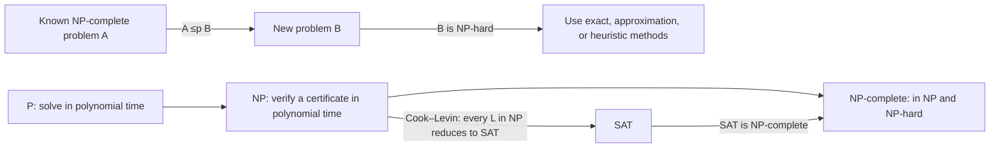
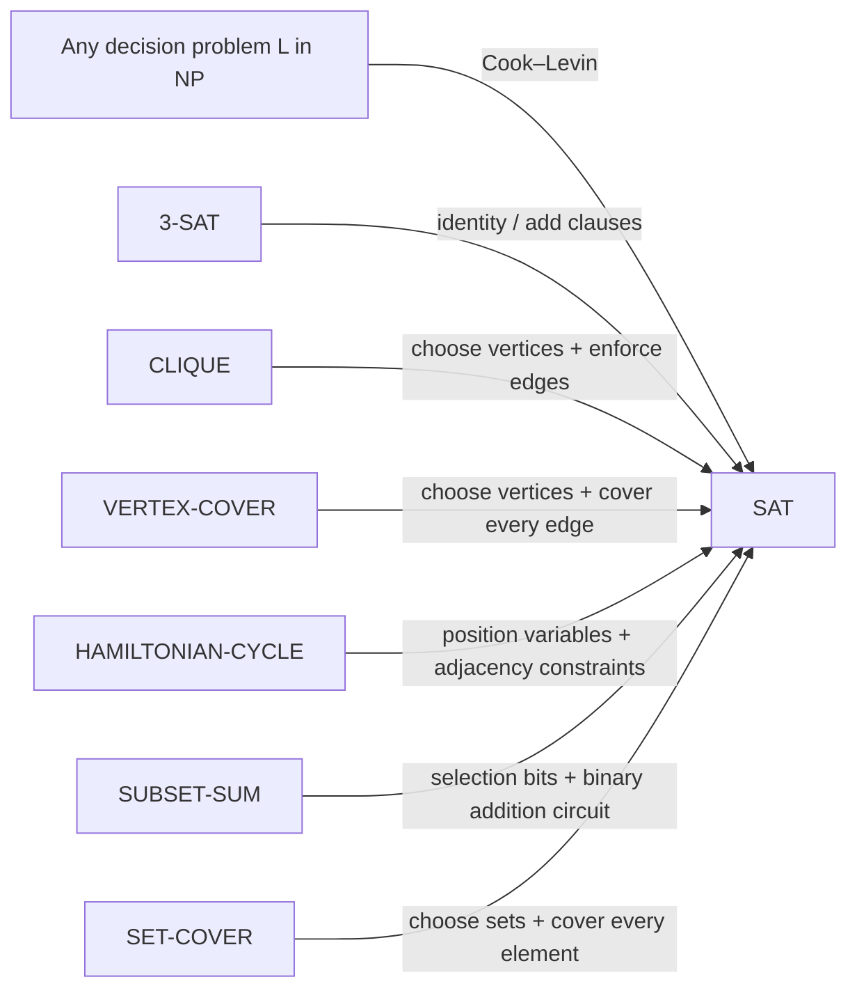
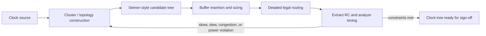

# NP-Completeness, SAT, and Why We Use Heuristics for Clock-Tree Routing

The NP-completeness chapter in *Introduction to Algorithms* can feel like a hard left turn: we go from designing algorithms that are provably fast to learning why some problems probably have no such algorithm. The good news is that this is not a chapter about giving up. It is a chapter about recognizing a kind of problem early enough to choose the right tool: an exact solver on small instances, an approximation with a guarantee, or a well-designed heuristic for the real chip we need to route today.

This post follows Chapter 34 of the fourth edition of CLRS—“NP-Completeness,” beginning on p. 1048—and then carries the ideas into a concrete application: using Steiner-tree ideas during VLSI clock-tree synthesis (CTS).

> **A terminology warning up front:** `NP` means *nondeterministic polynomial time*. It does **not** mean “non-polynomial,” and it does not mean “impossible in practice.”

Before diving into hardness proofs, the companion post, [Trees_n_Graphs](https://github.com/marcotulio956/Trees_n_Graphs), introduces asymptotic notation and the design techniques used when an exact polynomial-time solution is not available.

Recommended Watch


[](https://www.youtube.com/watch?v=YX40hbAHx3s)


## The chapter map
| CLRS section | Main question | Takeaway |
| --- | --- | --- |
| 34.1 Polynomial time | What counts as efficiently solvable? | Polynomial in the **input length** is the working notion of efficient. |
| 34.2 Polynomial-time verification | What does it mean to check a proposed solution quickly? | A short certificate plus a fast verifier defines `NP`. |
| 34.3 NP-completeness and reducibility | How can problems be compared? | Polynomial-time reductions transfer hardness. |
| 34.4 NP-completeness proofs | How do we prove a new problem is hard? | Prove membership in `NP`, then reduce a known NP-complete problem *to* it. |
| 34.5 NP-complete problems | Which problems form the core toolkit? | SAT, 3-SAT, CLIQUE, VERTEX-COVER, HAMILTONIAN-CYCLE, SUBSET-SUM, and many others. |



## 34.1 — Polynomial time: the baseline

Let `n = |x|` be the number of bits used to encode an input `x`. An algorithm runs in polynomial time if there are constants `c` and `k` such that

$$
T(x) \le c\,|x|^k.
$$

The complexity class `P` is the set of decision problems (yes/no questions) solvable by a deterministic algorithm in polynomial time:

$$
\mathsf{P} = \{L \mid \text{some deterministic algorithm decides } L \text{ in time } |x|^{O(1)}\}.
$$

Why insist on input *length*? Because representation matters. An algorithm that takes time proportional to an integer `W` is polynomial in the value of `W`, but exponential in the number of bits needed to write `W` when `W` is encoded in binary. That distinction is why we speak carefully about “polynomial time,” rather than casually saying “it looks fast.”

The focus on decision problems is deliberate. Optimization problems usually have a natural decision counterpart:

$$
\text{“Is there a solution with cost at most } B\text{?”}
$$

If we can answer that question efficiently, we can often find the optimum by repeated queries or a search-to-decision construction. The details depend on the problem, but the decision form gives complexity theory a crisp language.

## 34.2 — Verification and the class `NP`

For a language (decision problem) `L`, a verifier receives an instance `x` and a certificate `y`. It must run quickly and accept exactly the valid certificates:

$$
x \in L \iff \exists y,\ |y| \le |x|^{O(1)} \text{ and } V(x,y)=1,
$$

where `V` runs in polynomial time. This is the verifier definition of `NP`:

$$
\mathsf{NP} = \{L \mid L \text{ has a polynomial-size certificate verifiable in polynomial time}\}.
$$

The certificate is a *hint*, not something the verifier is expected to discover. For SAT, the hint is a truth assignment. For a Hamiltonian cycle, it is an ordering of vertices. For a Steiner tree, it is a set of selected routing edges.

### Example: verifying a Steiner-tree certificate

Consider the decision form of the weighted graph Steiner Tree problem:

$$
\begin{aligned}
\textsc{Steiner-Tree} = \{(G,w,R,B) \mid {}& \text{there exists a tree } T \subseteq G \\
&\text{that contains every terminal in } R \\
&\text{and } \sum_{e\in E(T)} w(e) \le B\}.
\end{aligned}
$$

Here `G = (V,E)`, `w(e)` is a nonnegative edge weight, `R` is the required terminal set, and `B` is the budget. A certificate can simply name the proposed edge set `F`.

```text
STEINER-VERIFY(G, w, R, B, F)
    if F is not a subset of E(G)
        return FALSE

    V_F ← all endpoints of edges in F
    if some terminal in R is not in V_F
        return FALSE

    if (V_F, F) is not connected
        return FALSE

    if |F| ≠ |V_F| - 1                 // connected + this test means “tree”
        return FALSE

    if Σ_(e in F) w(e) > B
        return FALSE

    return TRUE
```

Connectivity can be checked with BFS or DFS, the tree test is linear after that, and summing the weights is linear in the certificate size. The certificate itself contains at most `|E|` edges, so this verifies in polynomial time. Therefore the **decision** version is in `NP`. (This says nothing yet about whether it is NP-hard.)

## 34.3 — Reductions: a translator for problem difficulty

A polynomial-time many-one reduction from problem `A` to problem `B`, written

$$
A \leq_p B,
$$

is a polynomial-time computable transformation `f` such that

$$
x \in A \iff f(x) \in B.
$$

Think of `f` as a compiler: it rewrites every instance of `A` into an instance of `B` without changing the yes/no answer. If we had a fast solver for `B`, then we would get a fast solver for `A` for free.

```text
SOLVE-A-WITH-A-SOLVER-FOR-B(x)
    z ← f(x)                    // f is the reduction from A to B
    return SOLVE-B(z)
```

This gives the most important directional rule in the chapter:

> To prove that a new problem `B` is hard, reduce a known hard problem **A to B**. The arrow is `A ≤p B`, not `B ≤p A`.

### Many familiar problems can be compiled into SAT

The arrows below point **to SAT**. Each one represents a known polynomial-time encoding: a SAT solver can therefore be used as a general engine for these decision problems. This is useful in practice, but it is the opposite direction from the reduction normally used to prove a target problem NP-hard.



For example, a CLIQUE-to-SAT encoding can use a Boolean variable `x_(v,i)` meaning “vertex `v` occupies clique position `i`.” Clauses enforce one vertex per position, no vertex used twice, and an edge between every pair of selected positions. The formula is satisfiable exactly when the graph has a clique of the requested size.

### The class names

* `NP-hard`: every problem in `NP` reduces to it in polynomial time. An NP-hard problem need not be a decision problem, and it need not be in `NP`.
* `NP-complete`: both NP-hard **and** in `NP`. These are the hardest decision problems in `NP`, under polynomial reductions.
* `P ⊆ NP`: a polynomial-time solver is also a polynomial-time verifier—just ignore the certificate and solve the instance.

The famous open question is whether `P = NP`. If one NP-complete problem has a polynomial-time algorithm, then every problem in `NP` does. If `P ≠ NP`, then no NP-complete problem has a polynomial-time algorithm. We do not currently know which world we live in.

## SAT, 3-SAT, and the Cook–Levin theorem

Boolean satisfiability asks whether a Boolean formula has an assignment that makes it true. In conjunctive normal form (CNF), a formula is an AND of clauses, each clause an OR of literals:

$$
\varphi = \bigwedge_{i=1}^{m}\left(\bigvee_{j=1}^{r_i} \ell_{ij}\right),
\qquad \ell_{ij} \in \{x_k, \neg x_k\}.
$$

For example,

$$
(x_1 \lor \neg x_2 \lor x_3) \land (\neg x_1 \lor x_2) \land (\neg x_3)
$$

is satisfiable: choose `x1 = false`, `x2 = false`, and `x3 = false`. Checking a proposed assignment only requires scanning the formula, so SAT is in `NP`. In 3-SAT, every clause has exactly three literals; that restriction is still NP-complete.

The Cook–Levin theorem is the foundation stone:

$$
\boxed{\forall L \in \mathsf{NP},\quad L \leq_p \mathsf{SAT}.}
$$

Together with “SAT is in `NP`,” this proves that SAT is NP-complete. Cook’s original 1971 paper phrased the result in terms of tautology and polynomial reducibility; the modern SAT formulation above is the familiar equivalent starting point for NP-completeness proofs.

### The idea, without hiding the machinery

Let `M` be a nondeterministic polynomial-time machine for `L`, and let `p(|x|)` bound its running time. A Boolean formula can describe a `p(|x|)` by `p(|x|)` tableau of the computation: each row is a configuration and each row follows legally from the previous one. The formula has polynomial size because the tableau has polynomially many cells.

$$
\varphi_{M,x} =
\varphi_{\text{one-symbol-per-cell}}
\land \varphi_{\text{start}}
\land \varphi_{\text{legal-transitions}}
\land \varphi_{\text{accept}}.
$$

```text
COOK-LEVIN(M, x)
    t ← polynomial time bound p(|x|)
    create variables X[row, column, symbol]

    add clauses: each tableau cell has exactly one symbol
    add clauses: row 0 is M's start configuration on x
    add clauses: every 2×3 local window obeys M's transition rules
    add clauses: some row contains an accepting configuration

    return the resulting CNF formula φ_(M,x)
```

A satisfying assignment is exactly an accepting computation history (including the lucky nondeterministic choices). Thus

$$
x \in L \iff \varphi_{M,x} \text{ is satisfiable}.
$$

This is a striking result: SAT is not merely another difficult puzzle. It can express every efficiently verifiable search problem.

## 34.4 — The reusable NP-completeness proof pattern

Most reductions are not clever because they are long; they are clever because the target problem is engineered to preserve exactly the right choices and constraints. A good proof has four clearly separated parts.

```text
PROVE-NP-COMPLETE(B)
    1. Define B as a decision problem.
    2. Show B ∈ NP by giving a certificate and polynomial-time verifier.
    3. Choose a known NP-complete problem A.
    4. Build f such that x ∈ A iff f(x) ∈ B.
       Prove f is computable and has output size polynomial in |x|.
```

There are two logical directions in part 4, and both matter:

$$
x \in A \Rightarrow f(x) \in B
\qquad\text{and}\qquad
f(x) \in B \Rightarrow x \in A.
$$

The first normally maps a solution of `A` to a solution of `B`. The second shows that a solution to the constructed `B` instance cannot “cheat” in a way that fails to correspond to a solution of `A`.

### A tiny reduction-shaped example

For `k ≥ 3`, turn a SAT clause with fewer than `k` literals into a `k`-literal clause by repeating a literal:

$$
(a \lor b) \mapsto (a \lor b \lor b),
\qquad
(a) \mapsto (a \lor a \lor a).
$$

This preserves satisfiability and is plainly polynomial. Real NP-completeness reductions are usually more involved, but the checklist is identical: construction, polynomial bound, and the biconditional proof.

## 34.5 — A small working vocabulary of NP-complete problems

You do not need to memorize every proof. You do need a few source problems whose structures match the target:

| Source problem | Its “shape” | Useful when the target needs… |
| --- | --- | --- |
| 3-SAT | choose truth values under local clauses | binary choices and compatibility constraints |
| CLIQUE | choose mutually compatible vertices | pairwise compatibility |
| VERTEX-COVER | choose a bounded set covering edges | covering requirements |
| HAMILTONIAN-CYCLE | visit each vertex exactly once | ordered traversal / no repeats |
| SUBSET-SUM | select numbers with an exact total | arithmetic selection constraints |
| SET-COVER | cover elements using few sets | facility, coverage, or selection models |

CLRS gives a disciplined tour through this family. The intent is not to label every difficult-looking task as NP-complete; it is to recognize a familiar structure and prove the claim carefully.

## From “NP-hard” to an engineering plan

NP-hardness is a worst-case classification, not a ban on solving instances. Exact solvers routinely solve many industrial instances by exploiting structure, preprocessing, strong bounds, symmetry breaking, and a good formulation. But for large routing instances, there may be too little time to rely on exponential worst-case behavior.

That is where three different ideas must not be blurred together:

| Method | What it promises | Typical role |
| --- | --- | --- |
| Exact algorithm | Finds the optimum if it finishes | Small blocks, final sign-off, or a local subproblem |
| Approximation algorithm | Has a proven worst-case ratio | A predictable baseline when its assumptions match the model |
| Heuristic | Quickly finds a feasible, often good solution; no general guarantee | Day-to-day physical-design optimization |
| Metaheuristic | A reusable search strategy that guides heuristics | Escaping local optima across a large design space |

For a minimization problem, an approximation ratio has the form

$$
C(A(I)) \le \rho\, C(OPT(I)), \qquad \rho \ge 1,
$$

where `A(I)` is the returned solution and `OPT(I)` is an optimal one. A heuristic may be excellent without such a ratio. A metaheuristic—simulated annealing, tabu search, genetic algorithms, ant-colony optimization, or GRASP—does not supply the problem model by itself; it provides a disciplined way to explore candidate solutions.

## The VLSI case study: Steiner trees for clock-tree routing

Suppose a clock source must reach a set of sequential-element pins. At a simplified routing stage, terminals are points in the plane and wires prefer horizontal/vertical segments. The rectilinear distance is

$$
d_1((x_1,y_1),(x_2,y_2)) = |x_1-x_2| + |y_1-y_2|.
$$

The rectilinear Steiner minimum tree (RSMT) problem permits extra branching locations—Steiner points—to connect all terminals with small total Manhattan wirelength:

$$
\min_{T\text{ connects }R}\quad L(T)=\sum_{e\in E(T)} d_1(e).
$$

The decision version of the rectilinear Steiner tree problem is NP-complete, as shown by Garey and Johnson. In the obstacle-free planar model, Hanan’s result lets an exact method restrict candidate Steiner points to the **Hanan grid**, formed by all horizontal and vertical lines through terminals. That is a valuable finite reduction of the geometric search space—but it is not a magic polynomial-time solution for the general problem.

### A crucial modelling correction: a clock tree is not just an RSMT

Minimizing wirelength alone is often reasonable for a signal net. A clock tree also has to control arrival times, skew, slew, capacitance, buffer usage, power, congestion, routing layers, and blockages. Define the root-to-sink delay `D_T(s)` for sink `s`. Then skew is

$$
\operatorname{skew}(T)=\max_{s\in R}D_T(s)-\min_{s\in R}D_T(s).
$$

A simplified CTS objective could be written as

$$
\min_{T,\mathcal{B}}\quad
\alpha L(T)+\beta\operatorname{skew}(T)+\gamma\max_{s\in R}D_T(s)
+\delta\,P(T,\mathcal{B})+\eta\,N_{\text{buf}}(\mathcal{B}),
$$

subject to design-rule, blockage, slew, capacitance, electromigration, and timing constraints. Here `\mathcal{B}` denotes buffer locations/sizes and `P` is an estimated power cost. The weights and constraints come from the design, not from complexity theory.

This is why “use a Steiner tree for CTS” should mean **use Steiner-style topology and routing ideas as one component** of a timing- and constraint-aware flow. Research on bounded-skew clock routing makes the same point: exact zero skew can increase wire area and power, while a bounded skew target permits better trade-offs.



## A practical heuristic: randomized greedy construction plus local search

The following is intentionally a **template**, not a claim of a production-ready CTS implementation. It shows how a metaheuristic can sit around domain-specific routing routines.

First, create a legal routing graph `H`: nodes represent permitted access points, Hanan-grid/intersection points, and layer/via states; edges represent legal route segments with congestion-aware cost. Let `Cost(T)` combine wirelength, estimated delay, skew penalty, buffers, and rule violations. A violation should normally receive a very large penalty or make a candidate infeasible.

```text
GRASP-CTS(H, source, sinks, iterations, α)
    best ← NONE

    for r ← 1 to iterations
        T ← {source}
        U ← sinks                         // terminals not yet connected

        while U is not empty
            C ← all legal paths that connect one u in U to T
            score every path q in C by incremental Cost(T ∪ q)
            RCL ← {q in C : score(q) ≤ min(C) + α(max(C) - min(C))}
            q ← randomly choose one path from RCL
            T ← PRUNE-CYCLES(T ∪ q)
            remove the newly connected terminal from U

        T ← INSERT-AND-SIZE-BUFFERS(T)
        T ← LOCAL-REROUTE-AND-REBALANCE(T, H)

        if FEASIBLE(T) and (best = NONE or Cost(T) < Cost(best))
            best ← T

    return best
```

`α = 0` makes the construction greedier; larger values increase diversification. `LOCAL-REROUTE-AND-REBALANCE` is where CTS knowledge belongs: reroute a congested branch, move a merge point, swap a topology edge, resize a buffer, or repair the worst-skew sink. The method returns the best feasible tree it found, not proof that it is optimal.

### Escaping local minima with simulated annealing

Local improvement alone accepts only changes that improve the cost. That can trap the search. Simulated annealing sometimes accepts a worse candidate early on:

$$
\Pr(\text{accept } T')=
\begin{cases}
1, & \Delta \le 0,\\
e^{-\Delta/\tau}, & \Delta > 0,
\end{cases}
\qquad
\Delta=\operatorname{Cost}(T')-\operatorname{Cost}(T),
$$

where `τ` is a temperature that gradually cools.

```text
ANNEAL-CTS(T0, τ0, cooling, stop)
    T ← T0
    best ← T
    τ ← τ0

    while not stop(τ)
        T' ← a legal neighbor of T
             // e.g., change a merge, reroute a branch, or alter a buffer
        Δ ← Cost(T') - Cost(T)

        if Δ ≤ 0 or RANDOM(0,1) < exp(-Δ / τ)
            T ← T'
        if FEASIBLE(T) and Cost(T) < Cost(best)
            best ← T

        τ ← cooling × τ

    return best
```

The engineering choices determine whether this is useful: the move set must preserve legality (or have an effective repair method), the cost model must reflect the metrics that matter, and the stopping budget must fit the flow.

## What I would actually do in a CTS flow

1. Start with a realistic graph and constraints, not an unconstrained Euclidean sketch. Include placement, obstacles, preferred directions, layers, pin access, and congestion information.
2. Partition or cluster large sink sets. Use exact or high-quality methods on small subproblems, then connect and refine hierarchically.
3. Use a fast baseline: rectilinear MST or a simple Steiner-style construction gives a reference point and an initial topology.
4. Optimize topology, buffering, and routing together in a feedback loop. Re-extract RC and recheck skew/slew after meaningful changes.
5. Keep the objective multi-objective. A shorter tree that breaks skew, power, or slew is not a better clock tree.
6. Benchmark on representative blocks and corners, not just one pleasant instance. Report wirelength *and* skew, insertion delay, buffer count, power, congestion, runtime, and feasibility rate.

The theoretical conclusion is pleasantly practical: the known hardness of an idealized Steiner formulation gives us a reason to be honest about trade-offs. It does not tell us that CTS is hopeless; it tells us to use the right combination of model, structure, and search strategy.

## References and further reading

1. T. H. Cormen, C. E. Leiserson, R. L. Rivest, and C. Stein, *Introduction to Algorithms*, 4th ed., MIT Press, 2022. Chapter 34 (“NP-Completeness”), beginning on p. 1048. [Publisher page](https://mitpress.mit.edu/9780262046305/introduction-to-algorithms/).
2. S. A. Cook, “[The Complexity of Theorem-Proving Procedures](https://doi.org/10.1145/800157.805047),” *Proceedings of STOC*, 1971, pp. 151–158. The original Cook paper behind the Cook–Levin theorem.
3. R. M. Karp, “[Reducibility Among Combinatorial Problems](https://doi.org/10.1007/978-1-4684-2001-2_9),” in *Complexity of Computer Computations*, 1972. A classic catalogue of NP-complete problems and reductions.
4. M. R. Garey and D. S. Johnson, “[The Rectilinear Steiner Tree Problem is NP-Complete](https://doi.org/10.1137/0132071),” *SIAM Journal on Applied Mathematics* 32(4), 1977, pp. 826–834.
5. M. Hanan, “[On Steiner’s Problem with Rectilinear Distance](https://doi.org/10.1137/0114025),” *SIAM Journal on Applied Mathematics* 14(2), 1966, pp. 255–265. The source of the Hanan-grid result.
6. J. Cong, A. B. Kahng, C.-K. Koh, and C.-W. A. Tsao, “[Bounded-Skew Clock and Steiner Routing](https://vlsicad.ucsd.edu/Publications/Journals/j32_pub.pdf),” *ACM Transactions on Design Automation of Electronic Systems* 3(3), 1998, pp. 341–388. A useful bridge between Steiner routing, wirelength, delay, and skew.
